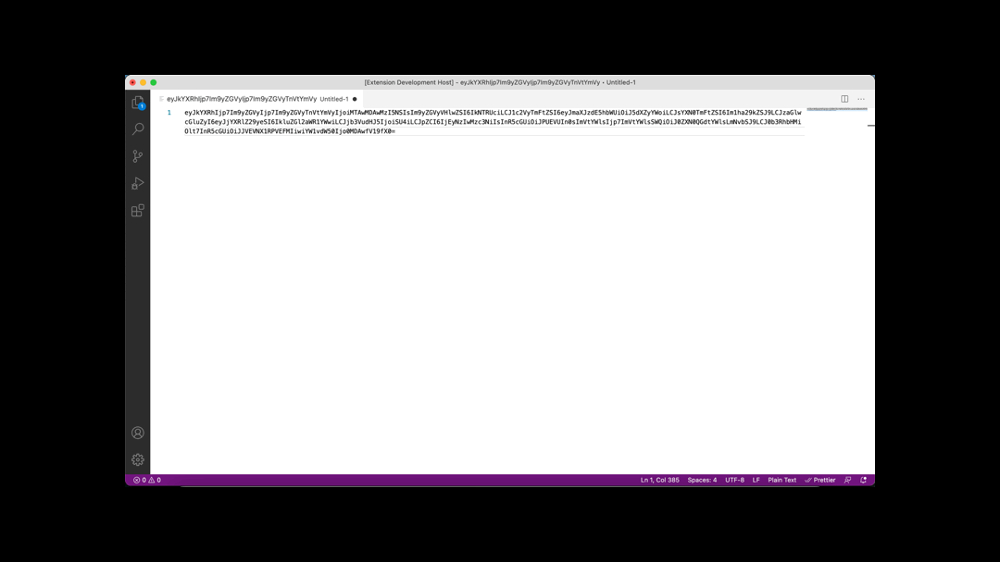
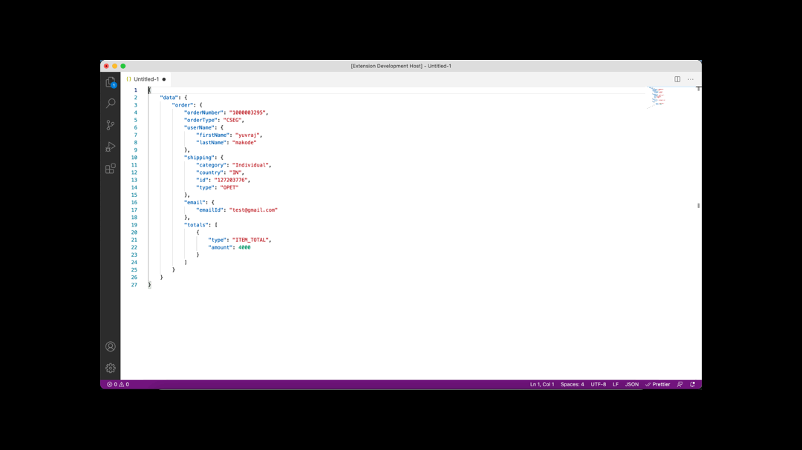

# Encoder/Decoder - Json/Base64 README

This extension is used to decode base64 to formatted json and encode json to base64

## Features

Use Command palattes `Shift+CMD+P` to seach keyword "Decode Base64 To Json"

Use Command palattes `Shift+CMD+P` to seach keyword "Encode Json To Base64"

## Known Issues

No issue

## Release Notes

### 1.1.0

Add features:

- Now you can choose a  Encoder/Decoder - Json/Base64 when it turns on:
- Move cursor to move start index after Encoder and Decoder.
- Change extension name from json-base64-vscode to Encoder/Decoder - Json/Base64.
- While encoding remove formatted json to json object then after that decode

### 0.1.0

Initial release of ...

Added features Decode base64 to json and encode json to base64

## Working with Markdown
* Open Command palattes `Shift+CMD+P` on macOS
* To Decode base64 to formatted json search in Command palattes  `Decode Base64 To Json`
* To Encode json to base64 search in Command palattes  `Encode Json To Base64`